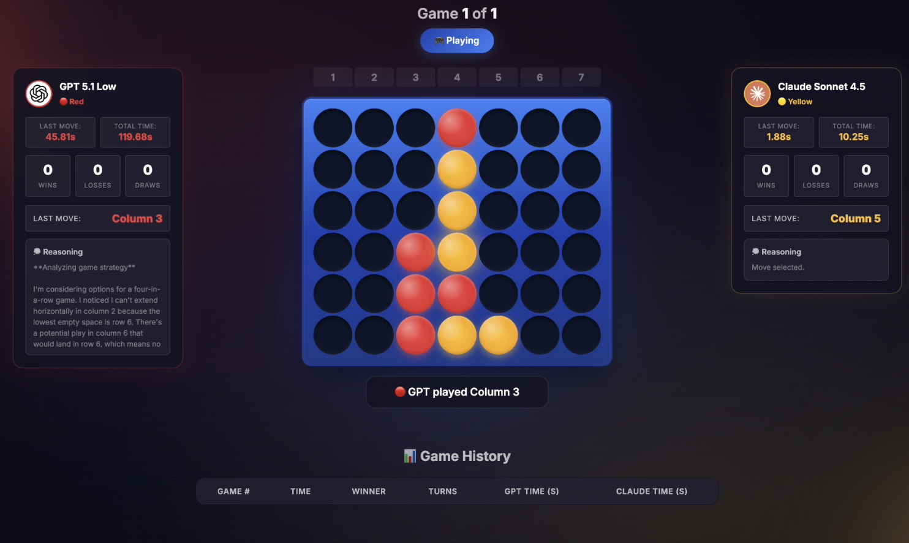

# Overview

This is a Battleship game where GPT 5.1 Low plays against Claude Sonnet 4.5.



**IMPORTANT:** You need to have an OpenAI and Anthropic API key to run this script.

# Quickstart
Create a .env file with the following variables:
```bash
OPENAI_API_KEY=your_openai_api_key
ANTHROPIC_API_KEY=your_anthropic_api_key
```

Install dependencies:
```bash
python3 -m venv venv && source venv/bin/activate && pip install -r requirements.txt
```

Run the app:
```bash
python app.py
```